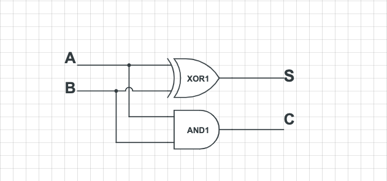
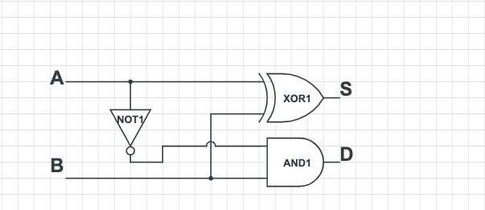

# 原码补码及反码

## 原码

原码就是直接用二进制数来表示一个数，和十进制差不多，十进制以十为底二进制则是以二为底。

例如十进制: `123 = 10 * 1^2 + 2*10^1 + 3 * 10^0 = 100 * 1 + 10 * 2 + 3*1 = 100 + 20 + 3`

二进制: `123 = 1111011 == 1*2^6 + 1*2^5 + 1*2^4 + 1*2^3 + 0*2^2 + 1*2^1 + 1*2^0 = 64 + 32 + 16 + 8 + 0 + 2 + 1`

## 反码

计算机都是使用逻辑电路来完成数字运算，例如使用加法电路来完成加法运算，一个全加器的实现:

全加器只需要两个逻辑门电路: 一个异或门和一个与门就完成了。整体来看还是非常简洁的。

减法电路则要稍微复杂一点，一个全减器的实现:

由上可见，加法电路只需要两个逻辑门，而减法电路则需要三个逻辑门，有没有一种方法编码方法可以用加法来代替减法？

在无限的数轴上这个想法是不可以实现的，但是计算机能描述的数字位数都是有限的（内存不可能无限大），相当于是在一个有限的数轴内描述一个数字。

例如 4 位的无符号整数类型，能表示的最大数字就 1111 (十进制数 585)，如果这个将这个数字再加一个 1 那么就会导致溢出，这个数字就变成了 0，相当于加了 1 和减了 585 的效果其实是一样的。

> 这有点类似于时钟，过了 12 点，就来到了 0 点。

利用这个原理，设改类型表示的最大值为: MAX，当前值为 C，要减的数为 S，可得 C-S = C + (MAX-C) + (C-S) + 1。

兜兜转转，好像还是没绕过减法。

## 补码
