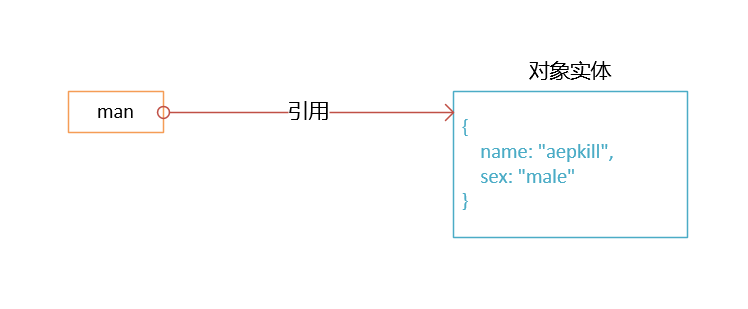
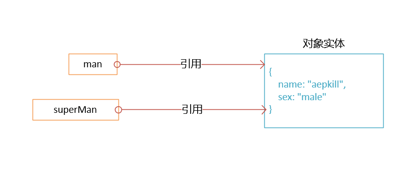
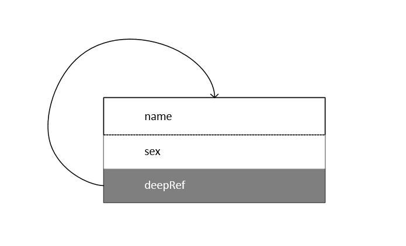
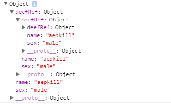
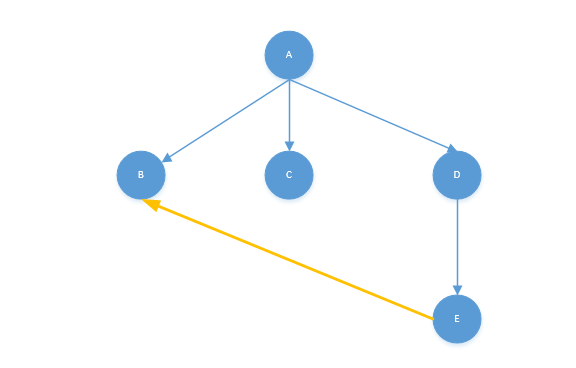

## 引用

在Javascript 中，将一个对象赋值给一个变量其实只是将这个对象的引用拷贝了一份，这种概念对于一直使用弱类型语言的同学来讲可能并不直观，下面来解释下这个概念。

假设写下了这样一段代码：

```javascript
var man = {
    name: 'aepkill',
    sex: 'male'
}
```

那么JS引擎在执行这段代码的时候就创建了一个包含name与sex这两个字段的对象实体，然后将这个对象的引用赋值给了变量man。



此时如果再将变量man赋值给另外一个变量，那么并没有创建一个新的对象实体，而是仅仅拷贝了这种引用关系。



```javascript
var superMan = man;
```

所以假设执行 man.name = 'Tokyo-Hot' ，那么superMan.name的值也会变成 'Tokyo-Hot'，因为其实他们引用的是同一个对象实体。

> 关于JS引擎的内部实现可以查看这篇文章: [http://www.jayconrod.com/posts/52/a-tour-of-v8-object-representation](A%20tour%20of%20V8%20object%20representation) (需翻墙)

## 浅拷贝

很多场景下并不希望出现像上文中那样：一个变量改变了对象的某个字段，所有引用该对象的变量再访问这个字段的时候都是被修改过的值。

我们希望有一种方法，能使两个变量相互独立，不再引用同一个对象。

这很容易实现，只需要申明一个新的对象，然后将这个对象的所有字段原封不动拷贝过去即可：

```javascript
function copy(obj) {
    // 申明一个新对象
    let result = {}
    let keys = Object.keys(obj),
        key = null;

    for (let i = 0; i < keys.length; i++) {
        key = keys[i];
        // 将原对象的所有属性取出来，并赋值给新对象        
        result[key] = obj[key];
    }
    return result;
}
```

写段代码测试下：

```javascript
var man = {
    name: 'aepkill',
    sex: 'male'
};
var superMan = copy(man);

man.name = 'Tokyo - Hot';

console.log(man.name);  //输出：Tokyo - Hot
console.log(superMan.name); //输出：aepkill
```

两个变量已经不在引用同一个对象，二者的修改是相互独立的，所以当修改man.name的时候并未对superMan造成影响。

## 深拷贝

上面已经完成了基本的拷贝，但是只拷贝了第一层的关系，如果对象不止一层的话，上面的函数就不适用了：

```javascript
var man = {
    name: 'aepkill',
    sex: 'male',
    concat: {
        eMail: 'a@aepkill.com'
    }
};
var superMan = copy(man);

man.concat.eMail = 'xx@163.com';

console.log(man.concat.eMail); // 输出: xx@163.com
console.log(superMan.concat.eMail); // 输出： xx@163.com
```

因为只拷贝了一层，所以man 与 superMan中的concat 字段还是引用同一个对象，所以当执行 man.concat.eMail = 'xx@163.com' 后，superMan.concat.eMail也变成了 'xx@163.com' ，该如何解决这个问题呢？

很自然就会想到，再对 concat 字段也进行一次浅拷贝不就好了吗。

但是，该如何用代码实现？

这里的案例只有两层对象嵌套，只要两个循环就能完成，不过再很多情况下对象的嵌套都不止两层，而且程序员都无法事先获知对象究竟有多少层的嵌套。

此时，需要对这个问题进行梳理并抽象：定义一个函数deepCopy，该函数遍历传入的对象，如果该字段的值不是一个对象则可直接赋值给新对象，否则对该字段用函数deepCopy进行递归操作。

```javascript
function deepCopy(obj) {
    // 创建一个新对象
    let result = {}
    let keys = Object.keys(obj),
        key = null,
        temp = null;

    for (let i = 0; i < keys.length; i++) {
        key = keys[i];    
        temp = obj[key];
        // 如果字段的值也是一个对象则递归操作
        if (temp && typeof temp === 'object') {
            result[key] = deepCopy(temp);
        } else {
        // 否则直接赋值给新对象
            result[key] = temp;
        }
    }
    return result;
}
```

再来测试刚才那段代码：

```javascript
var man = {
    name: 'aepkill',
    sex: 'male',
    concat: {
        eMail: 'a@aepkill.com'
    }
};
var superMan = deepCopy(man);

man.concat.eMail = 'xx@163.com';

console.log(man.concat.eMail); // 输出: xx@163.com
console.log(superMan.concat.eMail); // 输出：a@aepkill.com
```

## 循环引用拷贝

好了，我们的DeepCopy函数可以拷贝任意深度的对象了，看起来似乎是完美解决了对象深拷贝的问题。

但是还有一种特殊情况：循环引用。

例如：

```
var man = {
    name: 'aepkill',
    sex: 'male'
};
man['deefRef'] = man;

```

此时如果调用刚才的DeepCopy函数的话，会陷入一个循环的递归过程，从而导致爆栈：



解决这个问题也非常简单，只需要判断一个对象的字段是否引用了这个对象或这个对象的任意父级即可，修改一下代码：

```javascript
作者：AEPKILL
链接：https://zhuanlan.zhihu.com/p/23251162
来源：知乎
著作权归作者所有。商业转载请联系作者获得授权，非商业转载请注明出处。

function DeepCopy(obj, parent = null) {
            // 创建一个新对象
            let result = {};
            let keys = Object.keys(obj),
                    key = null,
                    temp= null,
                    _parent = parent;
            // 该字段有父级则需要追溯该字段的父级
            while (_parent) {
                // 如果该字段引用了它的父级则为循环引用
                if (_parent.originalParent === obj) {
                    // 循环引用直接返回同级的新对象
                    return _parent.currentParent;
                }
                _parent = _parent.parent;
            }
            for (let i = 0; i < keys.length; i++) {
                key = keys[i];
                temp= obj[key];
                // 如果字段的值也是一个对象
                if (temp && typeof temp=== 'object') {
                    // 递归执行深拷贝 将同级的待拷贝对象与新对象传递给 parent 方便追溯循环引用
                    result[key] = DeepCopy(temp, {
                        originalParent: obj,
                        currentParent: result,
                        parent: parent
                    });

                } else {
                    result[key] = temp;
                }
            }
            return result;
        }
```

来测试一下：

```javascript
var man = {
    name: 'aepkill',
    sex: 'male'
};
man['deefRef'] = man;

console.log(DeepCopy(man));
```

输出：



至此，已完成一个支持循环引用的深拷贝函数。

## 非循环引用的子对象拷贝

上面已经解决了深拷贝循环引用的问题，但是还不是特别的完善。

现在我们把一个对象想像成一棵树：



用代码来表示就是这样：

```javascript
var A = {
    B: {
        name: 'b'
    },
    C: {
        name: 'c'
    },
    D: {

    }
};
A.D.E = A.B;
```

此时 A.D.E 与 A.B 是相等的，因为他们引用了同一个对象：

```javascript
console.log(A.B === A.D.E) // 输出： true
```

如果再调用刚才的DeepCopy函数深拷贝一份对象A的副本X：

```javascript
var X = DeepCopy(A);
console.log(X.B); // 输出： {name: "b"}
console.log(X.D.E);// 输出: {name: "b"}
console.log(X.B === X.D.E); // 输出： false
```

虽然 X.B 和 X.D.E在字面意义上是相等的，但二者并不是引用的同一个对象，这点上来看对象 X和对象A还是有差异的。

这种情况是因为 A.B 并不在 A.D.E 的父级对象链上，所以DeepCopy函数就无法检测到A.D.E对A.B也是一种引用关系，所以DeepCopy函数就将A.B深拷贝的结果赋值给了 X.D.E。

知道原因那么解决方案就呼之欲出了：父级的引用是一种引用，非父级的引用也是一种引用，那么只要记录下对象A中的所有对象，并与新创建的对象一一对应即可。

```javascript
function DeepCopy(obj) {
    // Hash表 记录所有的对象引用关系
    let map = new WeakMap();
    function dp(obj) {
        let result = null;
        let keys = null,
            key = null,
            temp = null,
            existObj = null;
        
        existObj = map.get(obj);
        // 如果这个对象已被记录则直接返回
        if (existObj) {
            return existObj;
        }
        keys = Object.keys(obj);
        result = {};
        // 记录当前对象
        map.set(obj,result);
        for (let i = 0; i < keys.length; i++) {
            key = keys[i];
            temp = obj[key];
            // 如果字段的值也是一个对象则递归复制
            if (temp && typeof temp === 'object') {
                result[key] = dp(temp);
            } else {
                // 否则直接赋值给新对象
                result[key] = temp;
            }
        }
        return result;
    }
    return dp(obj);
}
```

测试一下： 

```javascript
var X = DeepCopy(A);
console.log(X.B); // 输出： {name: "b"}
console.log(X.D.E);// 输出: {name: "b"}
console.log(X.B === X.D.E); // 输出： true
```

好啦，已经完成一个支持循环引用拷贝，同时支持该对象下对其他非循环引用的子对象做拷贝的深拷贝函数了。

> 考虑到不要被额外的细节干扰核心内容，所以未实现拷贝不可遍历的值( key为Symbol和Property  Descriptor 中 enumable 字段为 false)，也未处理Array，Date，RegExp等特殊对象，在实际应用的情况下应该正视这些细节。
>
>
> 本文作者水平有限，若有理解欠缺或偏差之处，望不吝赐教。
>
> 您可以通过邮箱联系到我：a@aepkill.com。