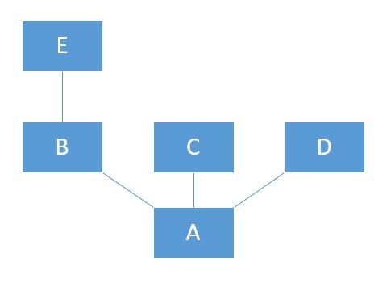

## 为什么需要依赖注入

在传统的编码过程中，如果我们需要一个对象，那么通常是自己主动去创建一个。

那么问题来了，要是我需要很多对象，岂不是要一个个去创建 ，如果我需要的这个对象还依赖其他对象，为了创建我们需要的对象，还要去实例化这个对象依赖的对象。

假设对象 A 依赖 B , C , D， 同时 B 又依赖 E。 

如图所示： 

 

用代码来表现这种关系:

```typescript
// B 依赖 E
class B {
    public constructor(public e: E) {

    }
}
class C {

}
class D {

}
class E {

}

// A 依赖 B,C,D
class A {
    public constructor(public b: B, public c: C, public d: D) {
    }
}
```

如果要创建一个 A 的实例:

```typescript
var e = new E();
var b = new B(e);
var c = new C();
var d = new D();
var a = new A(b,c,d);
```

可以看到，为了创建类A的一个实例，我们需要先创建 B，C，D 的实例，而为了创建一个B的实例，我们又需要创建一个E的实例。

在这个过程中程序员需要主动去追溯一个类的所有依赖，并亲自构建这种关系，无疑，这是非常繁重的工作，特别是依赖树变得庞大的时候，追溯依赖会变得十分棘手，甚至可以说是难以完成。

这个时候，很自然就会冒出一个想法：有没有一种工具，只要告诉它需要一个什么类的对象，它就可以自动的帮我查找依赖并且自动创建这个对象？

答案是肯定的，这就是大名鼎鼎的 **Ioc(Inversion of Control 控制反转)** 容器，在Angular中被称之为依赖注入。

控制反转容器，顾名思义，就是原先需要主动构建依赖的对象，现在则是将创建依赖的控制权交给容器来做，背后的脏活累活我们统统不管。

## 实现依赖注入

实现一个依赖注入还是十分简单的，只需要获取参数的类型，然后递归查找依赖并实例化注入即可。 

```typescript
// filename: ioc.ts


// 导入元数据支持
import "reflect-metadata";

// 存放所有可以被作为依赖项的类
const classPool: Array<Function> = [];

// 标记可被注入类
export function injectable(_constructor: Function) {
    // 通过反射机制，获取参数类型列表    
    let paramsTypes: Array<Function> = Reflect.getMetadata('design:paramtypes', _constructor);
    if (classPool.indexOf(_constructor) !== -1) {
        return;
    } else if (paramsTypes.length) {
        paramsTypes.forEach((v, i) => {
            if (v === _constructor) {
                throw new Error('不可以依赖自身');
            } else if (classPool.indexOf(v) === -1) {
                throw new Error(`依赖${i}[${(v as any).name}]不可被注入`);
            }
        });
    }
    classPool.push(_constructor);
}
// 创建实例
export function create<T>(_constructor: { new (...args: Array<any>): T }): T {
    // 通过反射机制，获取参数类型列表
    let paramsTypes: Array<Function> = Reflect.getMetadata('design:paramtypes', _constructor);
    // 实例化参数列表
    let paramInstances = paramsTypes.map((v, i) => {
        // 参数不可注入
        if (classPool.indexOf(v) === -1) {
            throw new Error(`参数${i}[${(v as any).name}]不可被注入`);
        // 参数有依赖项则递归实例化参数对象
        } else if (v.length) {
            return create(v as any);
        // 参数无依赖则直接创建对象
        } else {
            return new (v as any)();
        }
    });
    return new _constructor(...paramInstances);
}
```

 

有了依赖注入再回到上面那个创建 A 对象的例子就简单多了： 

``` typescript
import { injectable , create } from 'ioc';
@injectable
class B {
    public constructor(public a: E) {

    }
}
@injectable
class C {

}
@injectable
class D {

}
@injectable
class E {

}
@injectable
class A {
    public constructor(public b: B, public c: C, public d: D) {

    }
}

// 仅需要一行代码
let a = create(A);

//对比之前的代码 ， 如果依赖增加差距将更大
//var e = new E();
//var b = new B(e);
//var c = new C();
//var d = new D();
//var a = new A(b,c,d);
```

> 本文作者水平有限，若有理解欠缺或偏差之处，望不吝赐教。
>